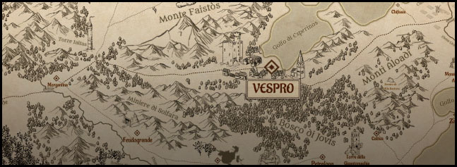

## Regno del Vespro

_Regno del Vespro_ è un'ambientazione originale creata da [Andrea Corinti](https://andreacorinti.com) e in seguito riadattata per fare da teatro al noto gioco di ruolo Dungeon World.

## Caratteristiche di base:

_Regno del Vespro_ rappresenta un setting low fantasy vagamente ispirato al folklore mediterraneo, in particolar modo quello sicliano, greco e arabo.

Non esitono razze tipiche dei mondi fantasy, ma tre distinte etnie socio-culturali di stampo umano.

La magia è estremamente rara e vista generalmente come superstizione dai non iniziati, mentre la religione svolge un ruolo cruciale nella società del regno.

Al posto degli allineamenti convenzionali, esiste la "Morale" che mostra il rapporto del personaggio nei confronti di leggi e ordini costituiti e prevede i classici Caotico, Legale e Neutrale.
